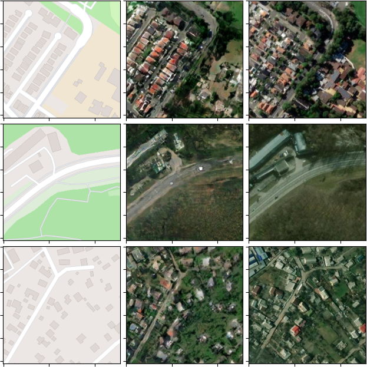
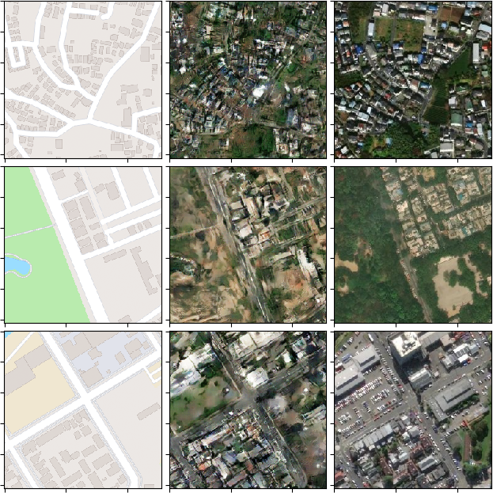
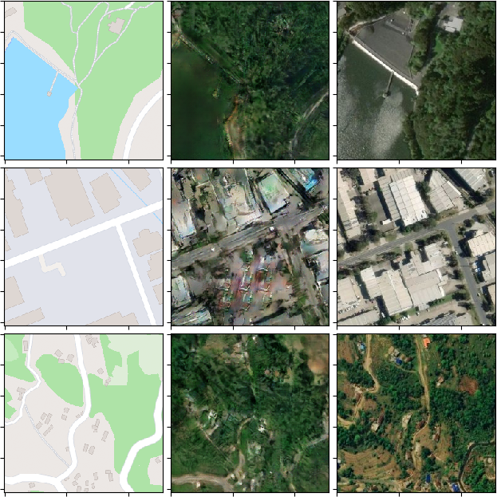
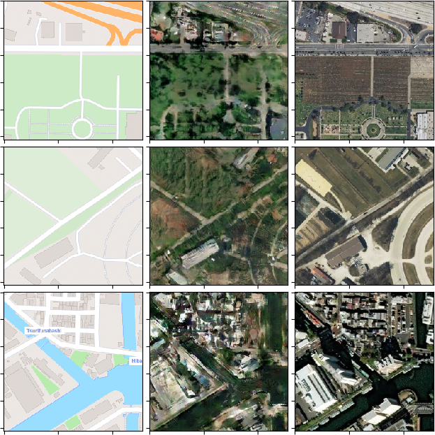

# Unveiling the Invisible: A GAN-driven Approach to Satellite Image Generation from Maps

This project uses a Conditional Generative Adversarial Network (cGAN) architecture to generate photorealistic predictions of satellite images from road map images. The architecture is adapted from the pix2pix architecture introduced by [Isola et al. (2016)](https://arxiv.org/pdf/1611.07004.pdf), with a U-Net acting as the generator and a PatchGAN discriminator.

Project authors (in alphabetical order):

* Ardavan Alaei Fard (@ardavan34)
* Jonathan Joonhan Ryu (@ryujonathan)
* Tanmay Patel (@pateltanmayp)
* Tyler Tian (@tylertian123)

## Gallery

Shown below are the results of the final model at epoch 230. The columns are, from left to right, model input, model output, and ground truth.

## Code Structure

* `dataset_generation/` contains all scripts used to collect the dataset used for training and evaluation
  * `gen_dataset.py` is a command-line utility that downloads map-satellite image pairs, sampled from a grid in the region specified
  * `clean_dataset.py` is a command-line utility that deletes samples in the dataset if the standard deviation of the pixel values in all 3 channels in the map image are less than certain threshold; this is used to filter out map images that contain little detail
* `model_training/` contains all scripts used to train and evaluate the model
  * `model.py` defines the models
  * `train.py` defines the training algorithm, loss functions, and sets of hyperparameters
  * `run.py` and `run.ipynb` both execute the training with a specific set of hyperparameters
  * `training_plot.py` plots the training curves, which are saved as CSVs during training
  * `generate.py` uses the model to generate satellite images, and displays the results
  * By default, `model_training/models` is used to store model checkpoints, and `model_training/results` is used to store CSVs of the losses over epochs
